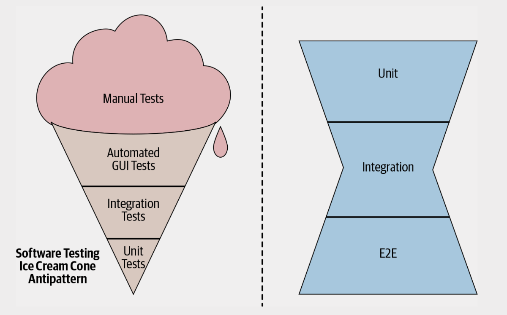
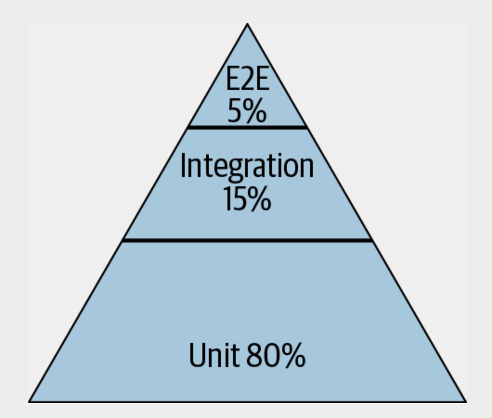
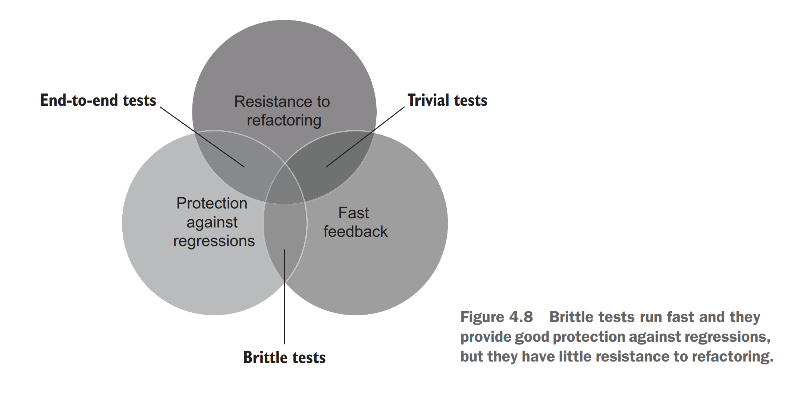

软件产品要实现工程化，测试是必不可少的一环。本文尝试从更多的维度去分析测试，更深入理解测试的重要性，以及探究写出好的测试代码的原则和实践。

如果你很少写测试代码，或者还在犹豫要不要在项目中引入测试，本文正适合阅读。如果测试已经成为你日常工作的必要流程和工具，本文也可以提供更多视角供您参考。

本文讨论的测试包括但不局限于单元测试、集成测试、回归测试和端到端（End-To-End）测试，强调各类测试的特点，以及如何配合起来保证软件的质量和研发效率。

## 重新理解测试的重要性
测试仅仅是为了发现软件中的问题吗？事实上，保证软件的正确性，只是测试的一个最基本的目标。

测试的一个重要的目标是，让改动成为可能。改动可以是：新增features、重构已有代码、重新设计等，测试让你更有信心完成这类改动。

测试是你的代码的第一个用户。不要小看这个用户，它驱使你思考代码设计上的一些问题。

如果发现一个模块很难测试，比如依赖过多、功能复杂，说明模块的设计有缺陷，没有遵循高内聚、低耦合的原则，这通常是一个重构的最佳时机。

这也为什么有测试驱动（TDD）这种开发模式。TDD 中的第二个 D，既可以是开发（development）也可以是设计（design）。当然，不一定要你采用测试驱动开发相对激进的策略，至少能引导你思考和审视自己写的代码。

如果不需要写测试，有些场景可能你不会有动力在开发阶段就考虑清楚，从而再后续阶段才暴露问题，增加了成本。而我们知道：越晚发现的问题，其修复成本越高。

测试也是一种可执行的文档。大家应该有这样的经验，产品的技术文档并不能很好地解释具体模块的代码，而好的测试代码能做到这一点，阅读测试用例代码，可以清楚看出测试目标的逻辑和上下文。

测试代码与文档和 Code Review 一样，对于团队整体的益处要大于对个人的益处，因此执行起来动力不是很足。你的测试代码，别人也会经常拿来执行，发现潜在问题。

即使团队内工程师都是资深的、高水平的，比如平均一个月引入一个 bug，也不能忽视测试。因为当团队成规模时，即使犯错率很低，整个团队引入的 bug 数量也是可观的；况且，一个 bug 的修复引入另一个 bug 也是很常见的现象。

还有一个重要观点是：测试的代码也需要维护。这是为了保证测试的有效性和运行的稳定性，因为测试带来的收益是建立在工程师对其的信任之上。

如果测试不能发现问题，运行不稳定总是失败，经常误报问题，就会丧失团队的信任。接着就会出现想方设法绕过测试的行为，久而久之就形同虚设了，也会给测试代码增加更多的复杂性。

从维护的观点说，测试代码与生产代码一样，在某种程度上不是资产（Assets）而是负债（Liability）。维护是一个持续还债的过程，不可维护就会债台高筑，项目失败就是必然了。

## 理解测试的规模
通常所谓测试规模的“小，中，大”如何定义？一个直接的对应是：单元测试、集成测试和端到端测试。

但所谓的规模的大小也不一定从代码量的角度衡量，而是按照测试执行的约束条件来定义。

约束条件比较严格的是“小”测试，它就可以是单元测试。约束条件包括：是否运行在单进程（线程），是否禁止IO访问（如磁盘、网络）等。

从约束条件入手的目的是：保证测试的快速执行和确定性。如果测试运行耗时很长或者结果不稳定，就会丧失团队的信任，就会被认为不可靠。

那么具体每一类测试应该写多少呢？Google 给出了一个建议以及对应的反模式：

冰淇淋（IceCream）：过多的端到端测试，很少的单元测试，不稳定、执行慢，多见于快速由原型推到生产环境的项目，没有详尽的测试。

沙漏（Hourglass）：端到端测试和单元测试较多，集成测试较少。这通常意味着设计问题：模块的接口抽象设计不清晰，导致各个模块之间紧密耦合，无法独立实例化隔离测试。例如这样一个业务流程：

> OrderService → PaymentProcessor → BillingSystem → Database

服务之间没有良好的接口依赖，而是直接依赖实例，那么测试时就需要启动整个流程所有服务实例，就相当于一个端到端的测试用例了；

每个服务可以实现各自的单元测试，但要实现其中两个或三个服务的集成测试，就比较困难。

正确的做法是，只依赖其他服务的接口，并通过依赖注入等方式添加依赖，而不是直接实例化需要的服务对象。

Google 推荐的测试规模分布式是金字塔式的：单元测试要达到 80% 左右的占比，执行条件较为苛刻的集成测试和端到端测试则依次减少。

这个比例也不绝对，实际应用时需要考虑团队的实际情况。实际场景中，冰淇淋模式反而更常见，而且上面的“奶油”部分会更大（手工测试）。

测试类型的占比要考虑两个因素：团队的生产效率和对产品质量的信心。

单元测试简单高效，可以及时收获有效反馈，发现代码逻辑问题，但无法提供全局的质量保证，毕竟单元测试覆盖率再高，你也不敢将整个系统直接上线。

端到端和手工测试，用例较复杂，有较多资源约束，执行缓慢，但却可以提供较强的信心。

集成测试的优劣势介于二者之间。因此，测试的设计不能局限于某一种规模，每一种测试都是有特定目的的，也是不可或缺的。

测试的规模会影响测试的覆盖范围（Scope）。

我们说单元测试的 Scope 较小，指的是验证代码的范围（覆盖率可以衡量），而不是实际执行的范围。由于依赖的存在，实际执行的代码可能比验证目标代码多很多。

这里多说一句测试覆盖率。

它考虑的是一行代码是否被执行过，而不是是否达到预期效果，这不是测试的目的。

一旦规定了测试覆盖率的下限，在执行时就会变成上限，因此很容不达预期。

测试覆盖率仅仅提供了未测试代码的一个参考值，仅此而已，并不能说明你的系统是否被良好地测试过。注意这里的区别。

## 可维护的测试

测试规模涉及速度和稳定性，除了影响团队信心外，本身就是可维护性的体现。

一个不稳定、执行缓慢的测试流程会拖慢开发者的进度，因此会遭到抵触，甚至会千方百计跳过测试流程。测试也就不可维护、形同虚设了。

想一想你的团队成员为何抵触自动化测试吧，所谓开发进度的压力，就是测试占用了大量开发以外的时间。执行测试的意愿都没有，更别提写测试用例了。

测试变慢的一个原因是，在测试中大量使用类似`sleep`和`setTimeout`的函数。目的一般是等待一个不确定时间的操作结束。

初看起来没什么大问题，如果这些代码出现在比较公用的工具代码中，那么累积的空闲时间可能会很长，严重拖慢测试执行进度。

一个替代方案是，采用轮询的方式查询结果，并结合一个超时时间，让测试失败，保证测试处于稳定状态。多数情况下，操作结果都会很快返回，因此不会有明显的延时。

不可维护的测试会影响开发人员效率，抵消了测试带来的优势。有以下两个特点：

- 脆弱：经常失败，却不是因为发现了bug，出错的地方往往与改动不相关。一个原因是，测试代码对代码的结构和逻辑有一些不合理的预设，而新代码打破了这个预设。开发人员为了通过测试，很可能加入更多workaround代码，导致测试代码更加脆弱。

- 不清晰：测试出错后，无法明确找到错误的代码以及修复方式。

一个健壮的测试不应该随着代码改动而改变，只要系统的需求没有发生变化。

即使是重构类的改动也是如此，只要已有功能没有改动，测试代码就不应该调整，而保持运行成功。

新增功能需要有新的测试保证。重构不应该轻易改变模块对外接口，而是优化内部实现。

否则，就不是纯粹的重构；或者其抽象层次不对，太依赖代码的实现细节，而不是测试功能本身。

为了避免测试代码的脆弱性，可以从以下几个方面入手：

- 仅通过公开接口测试，不要测试内部实现；（一个例子说明：为什么测试实现更为脆弱；）
- 测试状态而不是交互；

比如向数据库表插入一条数据。测试交互的做法是，验证某个内部插入方法（如 PutUser）是否调用；

这样做的脆弱性在于，未来这个插入方法可能被重命名或变更函数签名（因为不是公开方法，因此很有可能），此时测试会失败，但是代码逻辑没有问题。

测试状态的做法是，直接检查数据表中是否存在插入的数据即可，不关心数据是如何插入的，这样显然更健壮。

## Test Double 的使用

Google 推荐单元测试的待测系统（System Under Test，以下简称 SUT）尽量使用真实的依赖，如果依赖实现过于复杂可以使用 Test Doubles（测试替身）。如果依赖的模块不可变，或者有独立的实例，不会对其他测试产生影响，使用真实依赖也没有问题。

但很多时候，SUT 依赖模块的真实实现往往不稳定或者不可用（比如远程服务器，数据库连接，文件系统等），因此使用 Test Double 不可以避免。

这里需要澄清几个概念，我们通常把 Test Double 称为 Mocking 对象。事实上，Mocking 只是构建 Test Double 的一种方式：

Test Double 有三种形式：
- Faking：伪造一个依赖的对象或者模块，其实现尽量接近真实的实现。
- Stubbing：对函数的返回值进行模拟。
- Mocking：对函数的调用行为进行模拟。

Faking 是最推荐的 test double 类型，因为它最接近于真实实现。

但写 Faking 的代码需要对领域知识比较熟悉，并且需要花费更多的时间去构造 faking 模块。同时，faking 的代码需要维护，真实的实现发生变化，代码也要相应改变。

因此，faking 最适合真实模块的owner 自己去维护，这就带来了额外成本。况且，Fake 本身还需要自己的测试代码。

Fake 不可能百分百还原真实实现，可以忽略无关紧要的代码逻辑，例如错误处理等。但对于 API 的规范要忠实遵守，因为这涉及功能核心。F

如果从头写一个 Faking 模块比较耗时，可以针对特定方法或函数的实现，采用 Stubbing，但也有以下几个问题：

- 测试代码不清晰：对于测试代码阅读者来说，如果你不清楚SUT的具体实现，就看不懂stubbing的代码的目的。

- 依赖实现细节：由于针对很多方法都做了stubbing，其实是依赖了SUT当前的实现细节，因此测试时脆弱的。一旦实现逻辑发生变化，尽管功能没有变化，测试也容易失败。

- 没有真正测试关键功能：过度使用 stubbing，会导致测试行为与真实实现相距太远，达不到测试目标。直接使用真实实现或者采用 faking 方式更合理，尽管会牺牲一定的效率。

我们熟悉的 Mocking 本意是指让被测系统中的函数表现出特定行为，如以某些参数调用，调用多少次，先后顺序如何等。

Mocking 的问题是，它其实是在测试交互而不是状态。

测试交互只能保证特定的 function 被正确调用（次数、参数），不能保证 SUT 的功能正确性。

比如尽管保证 MockDBUtils.saveItem()正确调用，也不能说数据被正确存储了。测试状态就可以保证这一点，直接检查对应的 item 是否在数据库中即可。

与 stubbing 的问题一样，mocking 同样依赖实现细节，是脆弱的测试。

有工程是开玩笑称，针对交互的测试是变更检测测试（Change-Detector Test），代码有点风吹草动，它就会报错，尽管功能上并没有变化。

Mocking 有时候也很有用。如果测试的状态无法轻易获取，则可以测试交互的 function， 这在一定程度上保证了功能的下限。

另外，有时候具体的 function 调用顺序和次数是业务逻辑相关的，比如应用了缓存后，某些读取数据库的代码就只会执行一次，Mocking 此时就会派上用场。

使用 Test Double 的一个好处是判断可测试性：如果 Mocking object不能简单替换实际object，说明代码设计不具备可测试性。

从另一角度说，为什么集成测试是必要的，就是因为单元测试有一定的隔离性，无法保证测试依赖都是真实模块，因此无法保证模块集成起来以后还能正常工作。虽然推崇使用真实实现作为依赖，但实际操作起来总有不可行之处。

总之，测试代码优先考虑使用真实实现，其次考虑各类 Test Double的实现。Google 团队认为只要满足下面条件就可以采用真实实现：

> A real implementation is preferred if it is fast, deterministic, and has simple dependencies.

这是因为，快速反馈和执行的确定性就是我们追求的目标。

## 衡量测试的好坏
从测试的目的出发，结合上述讨论，我们可以看出衡量测试好坏的三个维度：

- 回归问题预防（Protection against regressions）
- 重构抵抗性（Resistance to refactoring）
- 快速反馈（Fast feedback）

第一点说的是测试发现bug的能力，保证不出现回归问题。

第二点说的是测试在重构之后应该保持稳定，不能大面积失败（如出现误报false-positive）。

第三点说的是测试应该快速得到结果，提供反馈。

有趣的是这三个维度不能同时满足，因为它们在某种程度上是互斥的。

比如完整的E2E测试，可以全面发现问题（第一点），也可以对抗重构，因为重构通常不改变端到端的行为（第二点），代价就是执行起来比较慢，无法提供快速反馈（第三点）；

如果考虑尽量写很简单的、较小范围的测试呢？

首先可以提供快速反馈（第三点），并且对于重构也是友好的，测试足够琐碎，因此不会大面积失败（第二点）；代价就是它不容易发现回归问题，因为回归问题通常涉及多个模块之间的交互：一个模块的改动影响了其他预期之外的模块。而过于琐碎的、范围较小的测试很难发现这样的问题。

同样，你也可以写出快速执行，并且可以发现回归问题的测试代码。

这样的测试可以测试相对完整的功能，规模不大（第一点），但十分依赖功能实现的细节，这样一旦有小的破坏就会报错，容易发现问题（第二点）。问题就是，测试代码十分脆弱，一旦有重构，就会大面积失败，而事实上功能并没有问题，仅仅是实现方式的改变。

这种三个维度只能满足两个的情况，与分布式系统涉及中的CAP理论十分类似。

实际应用中，AP和CP系统更为常见，牺牲了P的AC系统则比较少见；测试维度也有类似情况，快速反馈和发现问题都可以妥协，而支持重构则无法妥协：因为这是一个0或1的问题，一个测试总是误报失败，与大量测试总是误报失败都是一类性质的问题。

## 结语
希望本文的讨论能让您重新思考测试流程和实践，发挥出测试的最大效用。对这些话题感兴趣，推荐阅读以下两本书。下次我们继续讨论软件工程领域与流程和工具相关的其他话题。

- *Software Engineering at Google*
- *Unit Tests*