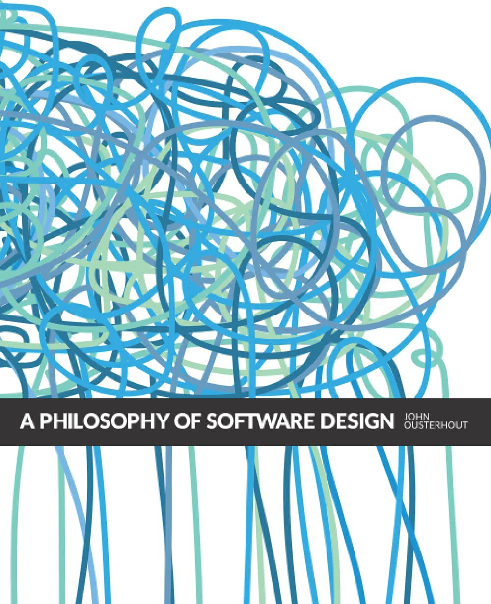

如果你翻开一本软件设计和架构相关的书籍，大概率会有软件复杂性这个话题的讨论。因为软件在构建的过程中，一个重要目标就是降低复杂性，尽管这不总是一个显式的目标。我们常用的一些手段和思想如设计模式、面向对象设计思想、软件工程开发流程，都有助于对抗软件复杂性。那么到底什么是软件的复杂性（Complexity），又如何在软件和开发中尽量降低复杂性呢？我在本文中谈谈对第一个问题的理解。

## 软件复杂性定义
复杂性的含义比较直白，但是放到软件这个上下文中，需要补充更多信息，因此用描述性的方式来定义更直观易懂。《软件设计的哲学》这本书中作者给出了软件复杂性的一个定义[^1]：

> "Complexity is anything related to the structure of a software system that makes it hard to 「understand」 and 「modify」 the system."

从这个定义可以看出，复杂性是一个负面的特性。我们常说某个系统”变得原来越复杂“，虽然是客观事实，但并不是无法避免；反之，复杂性是可以详细分析和管理的。

这里的关键词是理解（understand）和修改（modify），它们决定了软件复杂性的三个维度：

1. 认知负载（Cognitive Load）
2. 未知的未知（Unknown Unknowns）
3. 变更放大（Change Amplification）



### 认知负载
认知负载说的是，开发者要完成一个任务，需要了解多少信息。
 
比如，定义清晰的接口、API 完备的工具库、简单易用的框架、合理的代码组织、适度的抽象和重用等，都可以降低认知负载。这些也都是我们常见的“好代码”的特征。

以我们常用的模块化设计为例（后面文章我还会提到模块化设计是降低软件复杂性的有效方法），但要求是每个模块的设计要相对独立，工程师无论从哪个模块入手都可以开始工作，而不需要知晓其他模块的细节。因此，模块化系统的复杂性由「最复杂的模块」决定。

想想你的阅读代码的经历，刚才还在一个类和模块中挣扎，现在又不得不跳入另一个模块寻找定义和调用，然后又递归地进入其他模块，如此下去，最后都忘了刚才自己看到哪里了，思路也被打断，这就是较差设计引入的复杂性：**增加认知负载**。

注意这里的模块之间是相对独立，因为「依赖」不可避免。具体地说，一个模块的开发者只关心他所引用模块的接口，而非实现。如果需要理解接口的实现细节，那么设计就有问题。

认知负载的另一个维度是代码的可读性，这一点好理解，可读性差的代码必定会增加认知负载。同时，也要考虑**读代码的人对编程语言的掌握和理解程度**。不是使用最简单的语法的代码，可读性就是最强的，很多冗余的语法也会带来认知负担。使用最合适的语言特性尤为关键，这要求读代码的人要对语言特性有比较完整的掌握。（例如，Python中的赋值表达式）

一个常见的重构原则是保持方法尽量简单，只做一件事。但从降低软件复杂性的角度看，**很简单的方法可能没有提供足够的抽象**，比如从方法名就可以看出方法的实现，这样的实现还不如直接写在需要的地方，因而并没有降低复杂度，反而增加了复杂度。例如：
```python
class Order:
    def __init__(self, items):
        self.items = items

    def calculate_total(self):
        total = 0
        for item in self.items:
            total += item.price * item.quantity # 直接展开计算
        return total

    # 一个过度拆分的方法
    def multiply_price_and_quantity(self, item):
        return item.price * item.quantity

```
`multiply_price_and_quantity` 方法可以直接展开，语义很明确，无需定义方法。

这里就体现软件设计的哲学一面了：需要考虑单一职责和软件复杂度的权衡，以后我们可以深入探讨这个话题。
### 未知的未知
比增加认知负载更糟糕是「未知的未知」，即**你也不知道哪些地方需要改动，以及改动会影响哪些地方**。我想做过大型软件系统的工程师都深有同感，因为设计完善的软件系统是少见的。

一个典型的表现是：要做一个改动，需要搜索整个项目，找到可能的影响范围，这通常暴露了设计的缺陷。有时甚至通过搜索也不能发现所有的影响点，导致潜在的 bug；这一点开发者虽然有意识，但似乎无能为力，问题延后到测试阶段。

在生产环境上发现了一个问题，如果你根据现象就能大致判断出是什么改动引入的，那么这个问题顶多算“未知的已知”；反之，如果你不能立即判断根因，而需要通过系统的调试才能发现引入 bug 的改动，那么这个问题就属于“未知的未知”。

未知的未知引入的复杂性更为隐蔽，想要避免仍然依赖良好的软件和系统设计。

### 变更放大
一个模块变更需求会导致多个模块的代码变更，这就叫做变更放大。一个典型的案例就是将多个功能相同的变量在不同模块或者组件里定义多次，修改起来比较麻烦并且容易遗漏，因为命名不规范，使得搜索变量的引用也遇到困难。

如此显而易见的「反模式」，在生产代码中确并不少见，一个常见的原因是，每个开发者都只了解特定模块和领域的代码，并不知晓其他人负责的模块中有什么接口和常量定义，也没有协商和同意这类公共的定义。

复杂性的三个维度通常同时出现。例如，你发现同事的代码写了一段很奇怪、难懂的算法，且没有文档（认知负载增加），这段代码涉及你的业务需求改动，你不确定修改的后果是什么（未知的未知），因此就另起炉灶重新根据需求实现了自己的一段代码。未来一旦有业务变更，这段代码和同事的代码都需要修改（变更放大），但你也没有任何文档，导致修改遗漏，引入隐蔽的 bug（未知的未知）。

## 复杂性的成因
那么复杂性到底是如何引入的？

「依赖」（Dependency）是软件引入复杂性的一个因素，但是软件设计的目标不是消除依赖，而是「合理定义依赖」。因为依赖的引入是不可避免的，可以视为达到某些设计目的（如抽象和高内聚低耦合等）的副作用。

比如设计一个类和接口，就会在调用者代码中引入依赖，这是不可避免的，但是类的接口设计需要合理规划，以减少代码中不必要的依赖，并使接口易于使用，从而降低整体复杂性。

引入复杂性的第二个因素是「晦涩」（Obscurity），重要的信息不够显然时就是晦涩。比如变量的命名语义不够明确，影响代码的阅读；文档对某个模块的功能描述不清晰，导致理解出错；模块之间依赖关系的定义不够明确，增加调用者的认知负载，这也是晦涩，可以伴随着依赖因素存在。

**软件系统的整个设计也可以是晦涩的**，依赖大量的文档去解释和说明；不是文档越多就越能体现工程能力，反之暴露了设计中缺陷，导致整个架构和流程不够明晰。

复杂性的引入是「增量的」，软件系统在功能简单时可能是清晰合理的，随着一次次的提交，复杂性逐渐增加；这就体现了代码评审的价值，代码评审不只是关注功能实现以及代码风格，还要从复杂度的角度去提出修改意见，可能只是变量的命名，也可能修改整体设计，总之不能将就。

这里多说一句，我认为在开发新功能时解决老问题是有「复利效应」的。你当下修正的代码，会作为后续修正和开发的代码的基础，后续的有利于减少复杂性的努力，都在这次改动基础之上。当然可能出现的情况是，你这次改动为未来的某次重构设置了障碍，但从总体上看，积极效应是累积的，并且是非线性的增加。

## 复杂性的度量
理解了软件复杂性的概念和成因，有没有办法度量这个复杂性？

梅拉妮·米切尔在《复杂》[^2] 这本书中讨论了度量复杂性的几种方法，这些方法应用与复杂性科学领域，但或许对思考软件系统的复杂性有一些借鉴。

### 1. 大小度量
大小或者规模，是度量复杂性的一个直观想法，代码行数跟多的项目，通常来说可能更复杂。不过代码行数的累积只是表象，实际引入复杂度的仍然是代码的写法，即哪段代码是晦涩的，哪段代码引入了不必要的依赖。

类比生物界中的基因组，人类基因组碱基对数量是酵母菌的250倍，比起酵母菌，人类确实足够复杂；但是单细胞变形虫的基因组碱基对数量是人类的额225倍，说变形虫比人类很复杂，就不符合直觉了。

单纯的规模大小不能衡量复杂性。

### 2. 信息熵度量
提到复杂性我们通常也会想到信息熵（香农熵），它的一个通俗定义是：信息源相对于信息接收者的平均信息量或「惊奇度」。

设想一个由`A,B,C,D`四个字符组成的序列，如果是确定性的序列（1）如：

> A,A,A,A,A,... （1）

则熵是零，因为没有任何信息量（惊奇度）；反之一个随机序列（2）则有最高的熵：

> B,C,D,A,C,C,D,A,B,A,C... （2）

想要使用信息熵衡量复杂度，先要将其表示为某种序列，对于程序来说，可能是程序中`token`的组合。这并不总是容易做到，即使有表示也不一定合适。

还是类比基因组，完全相同的碱基对序列和完全随机的碱基对序列都不可能产生复杂的生命。对于程序来说，虽然我们不可能通过相同的token和随机的token写出有意义可运行的程序，承认复杂性介于二者之间，但是我们也不好比较任意两个程序的token序列，它们的信息熵有什么区别。

最复杂的对象不是最有序的或最随机的，而是介于两者之间。简单的香农熵不足以抓住我们对复杂性的直观认识。

### 3. 算法信息度量
算法信息复杂度定义为：

> 能够产生**对事物完整描述的最短计算机程序的长度**。

比如描述前面的序列（1）的计算机程序可以是：重复输出 A；而序列（2）的计算机程序则不容描述，没有确定的规则。

物理学家盖尔曼认为任何事物都是「规则性」和「随机性」的组合。就生物的例子而言，能够发育的生物的DNA具有许多独立和相关的规则性，这些规则需要可观的信息才能描述，因此会有很高的复杂性。显然，问题是我们如何给出这些规则。

对应到软件代码，一个项目代码要多少信息和规则才能准确描述，在一定程度上衡量了复杂度。这些规则可以是业务逻辑的定义，也可以是架构设计的思路，或者是代码的实现细节。而这些与我们定义软件复杂度关系不强，且不容易定量分析，我们再往下看。

### 4. 热力学深度度量
热力学深度的测量方式为：
> 首先是确定“产生出这个事物最科学合理的确定事件序列”，然后测量“物理构造过程所需的热力源和信息源的总量”

例如，要确定人类基因组的热力学深度，我们得从最早出现的第一个生物的基因组开始，列出直到现代人类出现的所有遗传演化事件，如随机变异、重组、基因复制等等。这样测得的热力学深度将极为庞大。

热力学深度可以类比代码的 commit 历史，每个「提交」就是一次事件，你的项目的现状就是通过一次次的代码改动演化而成的；这期间可能有较大的突变（架构调整、重构），可能有重组（业务变动），也可以有复制（相似的代码块）；当然，代码也会被删除，但这都是信息的总量的一部分。

有些改动符合软件的设计的最佳实践，极少进入额外复杂性，而有些则是“坏代码”，复杂性有显著增强。从理论上看，这些变化趋势是可以被持续观察和监控的。但还是那个问题，缺乏有效的度量手段。

### 5. 层次度量
学者西蒙（Herbert Simon）认为，复杂系统最重要的共性就是「层次性」和「不可分解性」。不可分解性指的是，在层次性复杂系统中，**子系统内部的紧密相互作用比子系统之间要多得多**。

对应到软件设计，这不就是模块的「高内聚、低耦合」特性吗？一些强依赖要限定在模块内部，通过合理的接口设计，减少模块之间不必要的依赖，保持良好的「层次性」。

《复杂》这本书中还提到了其他度量方法，可以参考阅读。值得注意的是，这里的一些度量方法只能类比和借鉴，获得一些思考上的趣味，并不一定具有实际意义。就像熵这个物理量，经常被借鉴到其他学科中（除了信息论），其实并没有实际意义。正如科普作家卓克说的：
> 把熵用来描述个人发展、公司经营、心理特质，这些言论都不用认真对待，全都是一些张冠李戴和牵强附会[^3]。

下篇我计划谈谈一个实际的关键问题：「如何降低软件复杂度」。

## 参考
[^1]: John Ousterhout. A Philosophy of Software Design (2/e). Yaknyam Press. 2021.
[^2]: [美] 梅拉妮·米歇尔著.复杂（第一推动丛书·综合系列）.湖南科学技术出版社.2018:143. 得到电子书：https://d.dedao.cn/G7F5hOWbZgaMNX3q
[^3]: https://www.dedao.cn/course/article?id=Q8dpgOa54NZMVzmYjGKByzxkwYm2Rl
